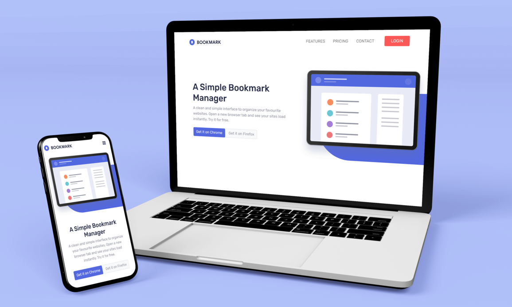

# Bookmark landing page

. 

This is my solution for a frontendmentor [Bookmark landing page](https://www.frontendmentor.io/challenges/bookmark-landing-page-5d0b588a9edda32581d29158) challenge.

## The challenge
This challenge will really test your layout skills. There are also areas that will require some JavaScript, such as the tabbed features section and the FAQ accordion.

Users should be able to:

- View the optimal layout for the site depending on their device's screen size
- See hover states for all interactive elements on the page
- Receive an error message when the newsletter form is submitted if:
  - The input field is empty
  - The email address is not formatted correctly

## Links

- Solution URL: [https://www.frontendmentor.io/solutions/bookmark-landing-page-using-bootstrap-scss-and-js-DKVIfgcqn](https://www.frontendmentor.io/solutions/bookmark-landing-page-using-bootstrap-scss-and-js-DKVIfgcqn)
- Live Site URL: [https://bookmark-landing-page-lyart.vercel.app/](https://bookmark-landing-page-lyart.vercel.app/)

## Built with

- Semantic HTML5 markup
- CSS custom properties
- Bootstrap 5
- SCSS
- JavaScript

## Author

- Website - [Asmaa Mahmoud](https://asmaa-mahmoud.vercel.app/)
- Frontend Mentor - [@AsmaaMK](https://www.frontendmentor.io/profile/AsmaaMK)
- Linkedin - [@asmaa-m-khalaf-04688a18b](https://www.linkedin.com/in/asmaa-m-khalaf-04688a18b/)